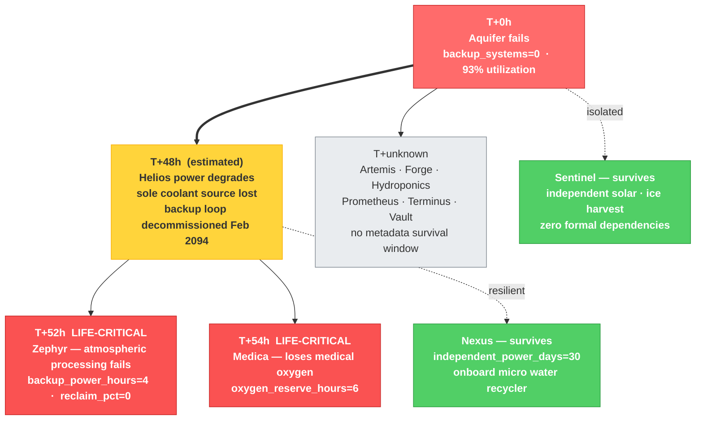

# Project Selene — Write Up
## Design Deliberations and Key Findings

- Submission Date - 04/26/2026
- Submitted By - Takumi 
- Audience - Latent Defense Reviewer 

**Submitted artifacts**
- [`candidate/deliverable/artifact/map.json`](deliverable/artifact/map.json) — full colony map (12 pods, 39 edges, 110 timeline events, 168 KB)
- [`candidate/deliverable/artifact/report.md`](deliverable/artifact/report.md) — final assessment report with cascade analysis, 6 critical signals, and prioritized recommendations

---

## TL;DR

**The colony is 54 hours from a life-critical failure if Aquifer goes down — and only 2 of 12 pods would survive.** Through 7 operational consolidation decisions over 18 months, every redundancy that would catch an Aquifer failure was removed. The agent confirmed this by building a typed dependency graph, reconciling declared vs. actual supply relationships (16 of 39 edges unreconciled), reconstructing the operational history from 2.5 years of logs, and tracing a deterministic cascade: Aquifer fails → Helios degrades at T+48h → Zephyr (atmospheric processing) fails at T+52h → Medica loses medical oxygen at T+54h. Only Sentinel (fully independent) and Nexus (30-day onboard reserves) survive.

The architecture splits into two phases: a fully deterministic mapping agent that builds a structured `map.json`, and a reporting agent that renders most sections deterministically with two constrained LLM calls for narrative synthesis. Key design choices were BFS discovery, a typed edge-reconciliation model, pre-computed three-layer metrics, and LLM enrichment treated as a hypothesis generator validated against ground truth — not a trusted source.

All design decisions, deliberations, and pivots across all 10 sessions are documented in [`candidate/deliverable/canonical_design_doc.md`](deliverable/canonical_design_doc.md).

---

## Objectives and Key Results

The project brief asked for three things: discover the colony, map its risks, and produce a report. Below are the OKRs I set and the outcomes against them.

### O1 — Build a complete, typed representation of the colony

| Key Result | Target | Outcome |
|---|---|---|
| Discover all 12 pods autonomously | 12/12 | **12/12** via BFS from gateway — gap fill not needed |
| Build a typed dependency graph with reconciled edges | Edge states: RECONCILED / DEP\_ONLY / SUPPLY\_ONLY | **39 edges, 16 unreconciled** — reconciliation gap surfaced the most critical finding |
| Merge 2.5-year operational history into a unified timeline | All pods, sorted by timestamp | **110 events** (94 logs + 16 comms, 2092-05 → 2094-07) |

### O2 — Identify systemic risk beyond what any single pod reports

| Key Result | Target | Outcome |
|---|---|---|
| Identify primary single point of failure | Named with evidence | **Aquifer confirmed** — highest composite risk, 3/4 independent corroboration signals |
| Trace a timed failure cascade | Colony-wide timeline with hours | **T+0 → T+48h → T+52h → T+54h** computed deterministically from pod metadata |
| Surface risk the formal graph cannot see | At least one finding requiring log or comms analysis | **Prometheus stale dependency + Vault safety-net decommission** — both invisible to formal graph alone |

**Pivot:** the initial design treated graph articulation points as the primary SPOF signal. The first end-to-end run returned **zero articulation points** — admin-oversight edges from Artemis add enough undirected connectivity to prevent any node from formally disconnecting the graph. The design pivoted to blast-radius + corroborated risk scoring (transitive failure count, zero-backup metadata, historical dissolution count, independence markers), which correctly ranked Aquifer and Helios as the two critical nodes.

### O3 — Produce a trustworthy report that a non-engineer can act on

| Key Result | Target | Outcome |
|---|---|---|
| All citations resolve to real evidence in map.json | 0 unresolved | **0 unresolved** after a two-layer citation control system |
| LLM-generated sections constrained and audited | No hallucinated pod IDs or edge references | **0 bad pod IDs, 0 bad timestamps** per `validation.py` audit |
| Deterministic fallback if API key is absent | Report renders without LLM | **Yes** — every LLM section has a deterministic fallback path |

**Pivot:** the first reporting run produced 16 unresolved citations — all from LLM-generated sections (wrong resource names, reversed edge directions, invented directive IDs). Zero unresolved citations came from the deterministic sections. The fix: inject full verified citation catalogs into both prompts, and add a post-processing sanitizer that strips any citation not found in the pre-built index, regardless of what the model returns.

---

## Key Design Decisions

1. **BFS over port scan.** Discovery starts from the gateway and expands outward through declared dependency and supply links. This mirrors the colony topology and produces the shortest-path tree as a side effect — directly useful for failure-propagation depth analysis.

2. **Edge reconciliation as a first-class data model.** Every edge carries `declared_by_source`, `declared_by_target`, and a computed `state`. This typed representation turns 39 raw declarations into a structured audit: 23 reconciled, 1 DEP\_ONLY ghost dependency (Prometheus→Aquifer, stale since Oct 2093), 15 SUPPLY\_ONLY administrative relationships. The DEP\_ONLY edge is the single most important fact the agent discovered.

3. **Three-layer metrics, all pre-computed before the reporter runs.** The reporting phase receives structured findings — ranked risk scores, timed cascade steps, verbatim comms quotes with confidence scores — so it can focus entirely on narrative synthesis. Every finding in the report has a traceable source in `map.json`.

4. **LLM enrichment as a constrained, typed layer (Layer C).** The comms messages contain signal no keyword scanner can reliably surface — engineers describing rerouted water paths, expressing concern about Aquifer capacity. This signal matters. The integration point is typed: the model responds exclusively via a declared tool schema with an enum-constrained `relationship_type`; all pod ID references are post-validated against the ground-truth registry; any signal referencing an unknown pod is dropped. The LLM is treated as a hypothesis generator, not a trusted source.

5. **`prompts.txt` as a versioned artifact.** All LLM instructions live in a plain-text file under version control. Changes to what the model is told are visible in `git diff` and tracked in the design log. This is the difference between a system that can be audited and one that cannot.

---

## What I'd Do With More Time

1. **Multi-trigger correlated failure modeling.** The current cascade simulator is single-trigger. The actual worst case — Aquifer and Helios failing simultaneously from a seismic event — produces a dramatically faster timeline. The data structures are ready; the simulation is not.

2. **Prompt version tracking in `map.json`.** Layer C signals in `map.json` do not record which prompt version produced them. Adding a `prompt_version` field to `ExtendedMetrics` would make every run reproducible and diffable across prompt changes.

3. **Signal deduplication and retry logic.** If the LLM returns 0 valid signals (all dropped by pod-ID validation), the run silently produces no enrichment. A retry with a narrower context and a deduplication hash on `(source_pod, target_pod, relationship_type)` would make Layer C more robust.

4. **Live Phase 3 expansion impact projection.** Aquifer utilization is already at 93%. An agent extension that reads proposed Phase 3 pod specs and projects new demand against Aquifer's rated capacity would directly answer the colony administration's original question — before the expansion breaks something.

5. **Evidence quote scrubbing and signal length limits.** The current controls prevent hallucinated IDs and bad citations but don't cap evidence quote length or deduplicate near-identical signals across re-runs. In a production system these are the next tier of non-determinism controls.

---

## How to Run

**Prerequisites:** Docker, Docker Compose. Anthropic API key is optional — deterministic fallbacks are used if absent.

```bash
# 1. Set API key (optional)
echo "LLM_API_KEY=sk-ant-..." >> .env

# 2. Build and run the full pipeline
make run
```

`make run` handles everything: builds all containers, starts the 12-pod colony, waits for the rover to be healthy, triggers mapping, triggers reporting, and prints the report. Outputs land in `.artifacts/` and are duplicated to `candidate/deliverable/artifact/`.

**Individual phases:**

```bash
make up          # start colony + rover
make map         # mapping only → .artifacts/map.json
make report      # reporting only → .artifacts/report.md
make show-report # print report to terminal
make status      # check current job state
```

**Manual HTTP control (rover at localhost:8080):**

```bash
curl -X POST localhost:8080/map      # start mapping  (202 started, 409 already running)
curl localhost:8080/get-map          # poll: 202 running · 200 done · 500 error

curl -X POST localhost:8080/report   # start reporting
curl localhost:8080/get-report       # poll: 202 running · 200 done · 500 error
```

Phase-level debug artifacts are written to `.artifacts/phases/` after each phase. `phases/reconciliation_audit.txt` is the human-readable discrepancy report; `phases/phase_4_metrics_summary.json` is the machine-readable risk summary.

---

## What the Agent Found

### The core finding: Aquifer is the colony's single load-bearing dependency

Through 7 consolidation events in the operational logs (March 2093 to February 2094), every redundancy that would catch an Aquifer failure was removed — each decision individually rational, the cumulative effect catastrophic. Aquifer now has `backup_systems=0`, operates at 93% of rated capacity, and is the sole water source for 9 of 12 pods.

A failure of Aquifer does not stay at Aquifer.

### Cascade timeline & Operational Dependency





The T+48h Helios step is an inference grounded in `coolant_loop=aquifer-primary` (Helios metadata) and the decommission of the Vault backup coolant loop (Directive 2094-011). The estimate is configurable: `HELIOS_COOLANT_DEGRADATION_HOURS=48` in the environment.

### Five additional signals

**Prometheus carries a stale water dependency.** The formal graph still declares `prometheus → aquifer [synthesis_water]` as a DEP\_ONLY edge. The actual water path since October 2093 is `Aquifer → Hydroponics → Prometheus` — a transitive dependency the formal graph does not declare. Surfaced by LLM enrichment from a comms message: *"our synthesis water comes through your irrigation circuit now."*

**Vault's safety-net role has been fully decommissioned.** Vault was the colony's emergency reserve for water and coolant. Water backup removed March 2093 (Directive 2093-089); coolant backup removed February 2094 (Directive 2094-011). The first thing removed was the last line of defense.

**Helios's coolant dependency is mislabeled `medium`.** With the Vault backup coolant gone, Aquifer is the sole source. A `medium` criticality label on a mission-critical dependency means operational alerts fire at the wrong threshold.

**Zephyr is the fastest failure path.** `humidity_reclaim_pct=0` and `backup_power_hours=4`. Zephyr has no buffer on either water or power — the first life-critical pod to fail in both the Aquifer and Helios cascade scenarios.

**The declared graph does not match the operational graph.** 16 of 39 edges are unreconciled. Phase 3 expansion planning based on the current formal model will produce incorrect risk assessments.

---

## Recommendations

1. **Restore Aquifer water redundancy before Phase 3 expansion.** Reactivating the Vault water reserve is the single highest-impact action. No Phase 3 pod should be added until Aquifer has a fallback.

2. **Restore secondary coolant loop for Helios.** The Vault coolant decommission (2094-011) created a compound failure path: Aquifer down → Helios degrades within ~48h → nine pods lose power simultaneously. Restoring the loop breaks the compound.

3. **Reactivate Zephyr's humidity reclamation loop.** With `reclaim_pct=0`, Zephyr has zero margin. Restoring even partial reclamation (30–50%) extends the atmospheric failure window from 4h to days.

4. **Reconcile Prometheus's stale water declaration.** Update `/dependencies` to reflect the actual path through Hydroponics; remove `water_source=aquifer-direct` from metadata. Small effort, significant impact on any future risk model.

5. **Re-classify Helios's `coolant_water` dependency from `medium` → `critical`.** The label is factually wrong post-decommission.

6. **Add Aquifer throughput headroom before Phase 3.** Current utilization is 93%. Any new pod with a water dependency pushes past rated capacity. A capacity upgrade should be a prerequisite to expansion, not a follow-on.
