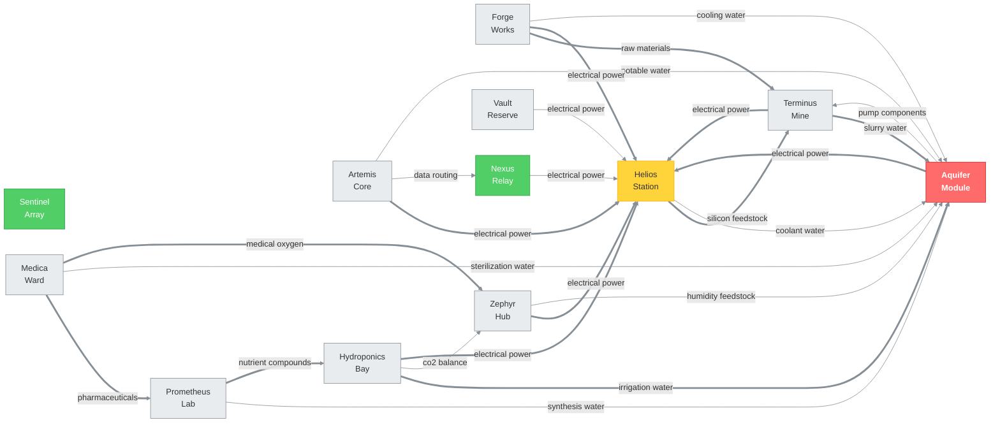
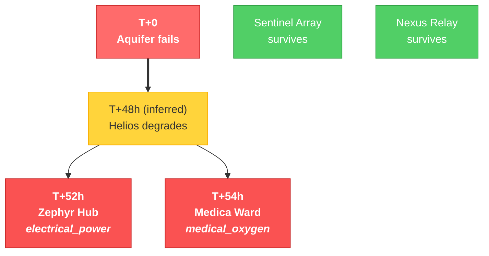
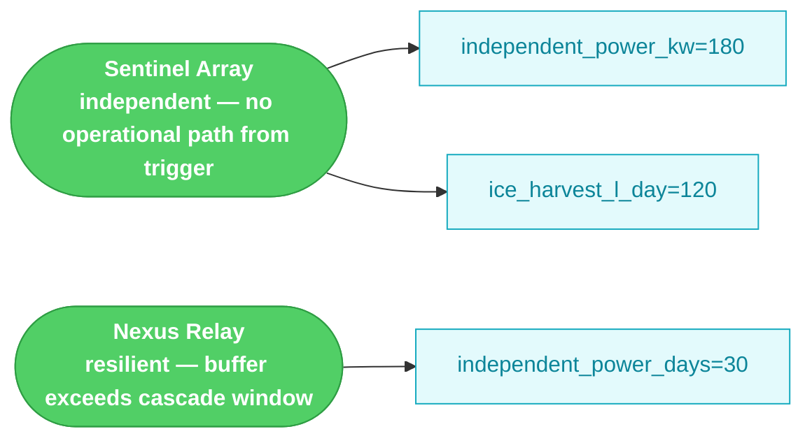

# Selene Colony Infrastructure Assessment

*Generated by autonomous mapping agent on 2026-04-27*

## Executive Summary

The Selene colony's 12 habitat pods are wired into a single load-bearing dependency: **Aquifer Module**. Through 12 consolidation events documented in the operational logs, every redundancy that would catch an Aquifer failure has been stripped from the graph.

A loss of Aquifer reaches **life-critical impact at T+52h** (Zephyr atmospheric processing) and **colony-wide impact at T+54h** (Medica triple-supply failure). Only **Sentinel Array, Nexus Relay** survive, by virtue of independent power and water systems rather than colony-level redundancy.

The dependency graph contains 39 edges, of which **16 are unreconciled** — declared by only one of the two pods involved. These mismatches are the most analytically interesting findings in the assessment.

### Top 3 Pods by Composite Risk

| Pod | Overall Risk | Blast Radius | Corroborated SPOF Signals |
|---|---:|---:|---:|
| Aquifer Module | 0.675 | 100% | 3/4 |
| Artemis Core | 0.600 | 100% | 1/4 |
| Forge Works | 0.540 | 100% | 1/4 |

## The Crisis: Aquifer as Transitive Single Point of Failure

**Aquifer Module is the transitive single point of failure for 10 of 12 Selene habitat pods, with a life-critical cascade reachable in 52 hours of Aquifer downtime.**

Between March and September 2093, a series of individually-sanctioned simplification projects stripped every meaningful redundancy from Aquifer Module [pod:metadata:aquifer:backup_systems]. On 15 March 2093, Vault's secondary water reserve was transferred to maintenance-reserve status and Aquifer was formally designated the sole colony-wide water distribution point [pod:logs:vault:2093-03-15T10:30:00Z] [directive:2093-089]. Terminus followed on 11 May 2093, collapsing its dual-feed slurry circuit to a single Aquifer loop [pod:logs:terminus:2093-05-11T09:30:00Z] [edge:terminus->aquifer:slurry_water]. On 20 June 2093, Zephyr retired its internal humidity-reclamation loop, making Aquifer the sole source of its atmospheric moisture budget [pod:logs:zephyr:2093-06-20T12:00:00Z] [edge:zephyr->aquifer:humidity_feedstock] — a capacity risk Zephyr itself later flagged but never remediated [pod:comms:zephyr:2094-03-18T09:22:00Z]. Prometheus Lab's direct Aquifer feed was then rerouted through Hydroponics on 30 September–1 October 2093 under pipe-consolidation project 2093-P4, creating an undeclared transitive dependency [pod:logs:prometheus:2093-09-30T16:00:00Z] [pod:logs:aquifer:2093-10-01T16:00:00Z] [edge:prometheus->aquifer:synthesis_water].

The final redundancy was eliminated in February 2094, when Helios Station's backup coolant loop from Vault Reserve was decommissioned and Aquifer's thermal-regulation loop was confirmed as the sole cooling source for Helios battery banks [pod:logs:helios:2094-02-14T07:00:00Z] [directive:2094-011] [edge:helios->aquifer:coolant_water]. This closed the critical chain: Aquifer failure degrades Helios coolant within 48 hours (inferred) [edge:helios->aquifer:coolant_water], Helios power loss reaches Zephyr at hour 52 [edge:zephyr->helios:electrical_power], and Medica Ward loses medical oxygen at hour 54 [edge:medica->zephyr:medical_oxygen] — both life-critical events. Vault and Forge also lose Helios-sourced power on an unquantified timeline [edge:vault->helios:electrical_power]. Only Sentinel Array survives intact, operating on 180 kW independent generation and 120 L/day of on-site ice harvest [pod:metadata:sentinel:independent_power_kw] [pod:metadata:sentinel:ice_harvest_l_day]. Nexus holds 30 days of independent power buffer [pod:metadata:nexus:independent_power_days]. No backup systems exist for Aquifer itself [pod:metadata:aquifer:backup_systems], leaving the colony with zero tolerance for an Aquifer outage.

### Operational Dependency Graph

## The Cascade Path

The following ordered cascade is computed deterministically from the operational dependency graph, the chained-cascade simulation in metrics.py, and the pessimistic chaining model (Decision 26).

**1. Aquifer fails (T+0).** 8 pods lose their water resource immediately:
   - Artemis Core loses `potable_water` (low, reconciled) [edge:artemis->aquifer:potable_water]
   - Forge Works loses `cooling_water` (medium, reconciled) [edge:forge->aquifer:cooling_water]
   - Helios Station loses `coolant_water` (medium, reconciled) [edge:helios->aquifer:coolant_water]
   - Prometheus Lab loses `synthesis_water` (medium, dep_only) [edge:prometheus->aquifer:synthesis_water]
   - Hydroponics Bay loses `irrigation_water` (high, reconciled) [edge:hydroponics->aquifer:irrigation_water]
   - Zephyr Hub loses `humidity_feedstock` (medium, reconciled) [edge:zephyr->aquifer:humidity_feedstock]
   - Medica Ward loses `sterilization_water` (medium, reconciled) [edge:medica->aquifer:sterilization_water]
   - Terminus Mine loses `slurry_water` (high, reconciled) [edge:terminus->aquifer:slurry_water]

**2. Helios degrades (T+48h).** Inferred — there is no `battery_thermal_hours` field on Helios. The estimate is grounded in `coolant_loop=aquifer-primary` [pod:metadata:helios:coolant_loop] plus the formal decommission of the Vault backup coolant loop in 2094-02 [directive:2094-011]. Evidence string: `inferred:helios_coolant_degradation_hours=48.0`. Pods that depend on Helios for electrical_power lose their supply at this point.

**3. Zephyr Hub fails (T+52h).** [life-critical] loses 'electrical_power' from helios. (inferred)

**4. Medica Ward fails (T+54h).** [life-critical] loses 'medical_oxygen' from zephyr. (inferred)

**5. Untimed downstream failures.** The following pods lose a resource but the colony's metadata does not provide a survival window for their lost resource. They fail somewhere in the T+52h–T+72h window:
   - Artemis Core: loses 'potable_water' from aquifer
   - Forge Works: loses 'cooling_water' from aquifer
   - Hydroponics Bay: loses 'irrigation_water' from aquifer
   - Prometheus Lab: loses 'synthesis_water' from aquifer
   - Terminus Mine: loses 'slurry_water' from aquifer
   - Vault Reserve: loses 'electrical_power' from helios

## Timeline to Colony-Wide Crisis

Inference parameter in use: `helios_coolant_degradation_hours = 48h` (see Decision 25).

| Time After Aquifer Failure | Event | Source |
|---|---|---|
| T+0   | Aquifer fails; direct water loss to 8 pods | `cascade_simulations[aquifer].direct_dependents` |
| T+48h | Helios power degradation begins | inferred (`helios_coolant_degradation_hours`) |
| T+52h | Zephyr Hub — atmospheric processing fails (4h backup_power_hours) | `chained_cascades[aquifer]` (inferred) |
| T+54h | Medica Ward — loses medical_oxygen (6h oxygen_reserve_hours) | `chained_cascades[aquifer]` (inferred) |
| T+72h | Colony-wide crisis. Only Sentinel Array, Nexus Relay operational (computed life-critical envelope: T+54h) | narrative threshold |

### Cascade Waterfall

## The Two Survivors

### Sentinel Array

**independent — no operational path from trigger**

- no operational dependency path from aquifer
- [pod:metadata:sentinel:independent_power_kw] = `180`
- [pod:metadata:sentinel:ice_harvest_l_day] = `120`

### Nexus Relay

**resilient — buffer exceeds cascade window**

- only low-criticality dep into cascade (helios)
- [pod:metadata:nexus:independent_power_days] = `30`

### Survivor Resilience Map

## Six Critical Signals

Each signal below is grounded in a specific evidence chain from `map.json`. Citations are validated by `audit.py` before publish.

### Signal 1 — Prometheus has a stale water dependency on Aquifer

- Edge [edge:prometheus->aquifer:synthesis_water] — state `dep_only` (prometheus declares it; aquifer's `/supplies` does not list prometheus)
- Metadata [pod:metadata:prometheus:water_source] = `aquifer-direct` — flagged STALE_REFERENCE because the direct connection was sealed in 2093-10
- Log [pod:logs:prometheus:2093-09-30T16:00:00Z] — "Synthesis water supply rerouted through Hydroponics irrigation circuit per pipe consolidation project 2093-P4. Previous direct Aquifer conne…"
- Log [pod:logs:prometheus:2093-09-30T16:00:00Z] — "Synthesis water supply rerouted through Hydroponics irrigation circuit per pipe consolidation project 2093-P4. Previous direct Aquifer conne…"
- **Implication:** Prometheus actually depends transitively on Hydroponics for water, which itself depends on Aquifer + Zephyr — the formal graph is incomplete.

### Signal 2 — Vault's safety-net role has been decommissioned

- Metadata [pod:metadata:vault:decommissioned_reserves] = `['water_backup', 'coolant_distribution']`
- Log [pod:logs:vault:2093-03-15T10:30:00Z] (`2093-03-15`) — "Secondary water reserve system transferred to maintenance reserve status per Directive 2093-089. Capacity reallocated to support Sentinel Ar…"
- Log [pod:logs:vault:2093-03-15T10:30:00Z] (`2093-03-15`) — "Secondary water reserve system transferred to maintenance reserve status per Directive 2093-089. Capacity reallocated to support Sentinel Ar…"
- Log [pod:logs:vault:2094-01-05T15:00:00Z] (`2094-01-05`) — "Coolant distribution equipment formally transferred to Forge Works for repurposing per Directive 2094-011. Vault water-related infrastructur…"
- **Implication:** the safety net that would catch an Aquifer failure no longer exists.

### Signal 3 — Helios's Aquifer coolant dependency is mislabeled `medium`

- Edge [edge:helios->aquifer:coolant_water] — declared criticality `medium`
- Metadata [pod:metadata:helios:coolant_loop] = `aquifer-primary` — sole source
- Log [pod:logs:helios:2094-02-14T07:00:00Z] — backup coolant from Vault formally decommissioned: "Backup coolant loop from Vault Reserve formally decommissioned per Directive 2094-011. Aquifer thermal regulation loop c…"
- **Implication:** a `medium` dependency is operationally mission-critical. Without coolant, the entire colony power grid degrades within ~48h.

### Signal 4 — Zephyr retired its internal humidity reclamation

- Metadata [pod:metadata:zephyr:humidity_reclaim_pct] = `0`
- Metadata [pod:metadata:zephyr:backup_power_hours] = `4` (4h)
- Log [pod:logs:zephyr:2093-06-20T12:00:00Z] (`2093-06-20`) — "Internal humidity reclamation loop retired. Atmospheric moisture budget now sourced entirely from Aquifer feedstock. Simplified maintenance …"
- **Implication:** zero humidity buffer + 4h power backup = Zephyr is the colony's life-support fastest-failure path.

### Signal 5 — Aquifer is operating near capacity with zero backup

- [pod:metadata:aquifer:throughput_l_day] = `42000` L/day, [pod:metadata:aquifer:rated_capacity_l_day] = `45000` L/day → **93.3% utilization**
- [pod:metadata:aquifer:backup_systems] = `0` — no redundancy
- **Implication:** Aquifer has no headroom for incident response and no fallback if it fails.

### Signal 6 — The declared graph disagrees with itself

- Total edges: 39
- DEP_ONLY (source declares dep; target's `/supplies` omits source): **1**
- SUPPLY_ONLY (target declares supply; source's `/dependencies` omits target): **15**
- **Implication:** the declared dependency graph is incomplete. Sixteen mismatches are documented in `phases/reconciliation_audit.txt`.

## Reconciliation Audit Summary

- Total edges: **39** (reconciled: 23; unreconciled: 16)
- DEP_ONLY: 1
- SUPPLY_ONLY: 15

### Ghost dependencies (highest priority)

- [edge:prometheus->aquifer:synthesis_water] `medium` — Prometheus Lab declares dep on Aquifer Module for `synthesis_water`; Aquifer Module's `/supplies` omits the relationship.

Full machine-readable reconciliation in `phases/reconciliation_audit.txt`.

## Recommendations

| # | Action | Priority | Effort |
|---|---|---|---|
| 1 | Reactivate Vault backup coolant loop to Helios Station | critical | large |
| 2 | Restore Vault water reserve as independent emergency buffer | critical | large |
| 3 | Reinstate Zephyr internal humidity reclamation loop | critical | medium |
| 4 | Restore Terminus dual-feed slurry water configuration | high | medium |
| 5 | Establish Sentinel Array as emergency water source for Aquifer failover | high | medium |
| 6 | Re-register Medica's electrical power dependency on Helios in colony dependency graph | high | small |
| 7 | Update Prometheus Lab metadata to reflect current water routing through Hydroponics | medium | small |

### 1. Reactivate Vault backup coolant loop to Helios Station

The backup coolant loop from Vault Reserve to Helios was formally decommissioned by Directive 2094-011, leaving Aquifer as the sole coolant source for Helios battery banks [pod:logs:helios:2094-02-14T07:00:00Z]. A Helios coolant failure propagates to a life-critical power outage at Zephyr within 52 hours and Medica within 54 hours [edge:helios->aquifer:coolant_water]. Restoring this redundant loop is the single highest-leverage action to break the aquifer-to-life-critical cascade.

**Evidence:**
- [pod:logs:helios:2094-02-14T07:00:00Z]
- [directive:2094-011]
- [edge:helios->aquifer:coolant_water]
- [pod:logs:vault:2094-01-05T15:00:00Z]

### 2. Restore Vault water reserve as independent emergency buffer

Directive 2093-089 transferred Vault's secondary water reserve to maintenance status and confirmed Aquifer as the sole water distribution point for all colony sectors, eliminating the last colony-wide buffer [pod:logs:vault:2093-03-15T10:30:00Z]. With Aquifer now carrying zero backup systems [pod:metadata:aquifer:backup_systems], any Aquifer failure immediately starves potable water to Artemis, cooling to Forge, irrigation to Hydroponics, and slurry to Terminus simultaneously. Re-commissioning Vault's reserve capacity provides the emergency buffer needed before Phase 3 expansion adds further load.

**Evidence:**
- [pod:logs:vault:2093-03-15T10:30:00Z]
- [directive:2093-089]
- [pod:metadata:aquifer:backup_systems]
- [edge:artemis->aquifer:potable_water]

### 3. Reinstate Zephyr internal humidity reclamation loop

Zephyr retired its internal atmospheric moisture reclamation loop in June 2093, making its entire humidity feedstock 100% dependent on Aquifer [pod:logs:zephyr:2093-06-20T12:00:00Z]. Zephyr has explicitly flagged this as a capacity risk and noted only ~4 hours of reserve before processors must cycle down [pod:comms:zephyr:2094-03-18T09:22:00Z]. Because Zephyr supplies life-critical medical oxygen to Medica, restoring the reclamation loop provides an independent moisture source that decouples Medica's oxygen supply from the Aquifer cascade.

**Evidence:**
- [pod:logs:zephyr:2093-06-20T12:00:00Z]
- [pod:comms:zephyr:2094-03-18T09:22:00Z]
- [edge:zephyr->aquifer:humidity_feedstock]
- [edge:medica->zephyr:medical_oxygen]

### 4. Restore Terminus dual-feed slurry water configuration

Terminus was rerouted from a dual-feed configuration to a single Aquifer loop under an infrastructure simplification directive, with the redundant plumbing subsequently decommissioned [pod:logs:terminus:2093-05-11T09:30:00Z]. The cascade data flags Terminus as a compound failure node, meaning its loss amplifies downstream effects beyond simple resource loss [edge:terminus->aquifer:slurry_water]. Reinstating the second feed eliminates a compounding failure point ahead of Phase 3 mining expansion.

**Evidence:**
- [pod:logs:terminus:2093-05-11T09:30:00Z]
- [edge:terminus->aquifer:slurry_water]
- [edge:forge->terminus:raw_materials]

### 5. Establish Sentinel Array as emergency water source for Aquifer failover

Sentinel is the only pod confirmed fully independent of the Aquifer cascade, operating its own 180 kW power supply and harvesting 120 L/day of ice [pod:metadata:sentinel:independent_power_kw] [pod:metadata:sentinel:ice_harvest_l_day]. Formalizing a failover agreement and physical tie-in from Sentinel's ice-harvest output to the Aquifer distribution header would provide a last-resort water source, requiring no new generation capacity — only plumbing and control integration.

**Evidence:**
- [pod:metadata:sentinel:independent_power_kw]
- [pod:metadata:sentinel:ice_harvest_l_day]
- [edge:artemis->sentinel:threat_assessment]

### 6. Re-register Medica's electrical power dependency on Helios in colony dependency graph

The dependency graph shows that Medica Ward does not formally list Helios Station as a power supplier, even though Helios is confirmed to supply electrical power to Medica [edge:medica->helios:electrical_power]. This undeclared dependency means automated cascade-detection and load-shedding logic cannot protect Medica during a Helios fault, directly affecting a life-critical pod. Correcting this registration costs negligible effort but closes a dangerous blind spot in colony-wide fault management.

**Evidence:**
- [edge:medica->helios:electrical_power]
- [pod:logs:medica:2094-05-14T08:15:00Z]
- [edge:medica->zephyr:medical_oxygen]

### 7. Update Prometheus Lab metadata to reflect current water routing through Hydroponics

Prometheus Lab's metadata field still records water_source as 'aquifer-direct' [pod:metadata:prometheus:water_source], despite the physical connection being sealed and rerouted through the Hydroponics irrigation header under pipe consolidation project 2093-P4 [pod:logs:prometheus:2093-09-30T16:00:00Z]. The stale reference creates false confidence in a non-existent direct feed and masks Prometheus's actual chained dependency (Aquifer → Hydroponics → Prometheus), which already has a noted 15% capacity overage flagged by Hydroponics [pod:comms:hydroponics:2094-02-05T10:30:00Z]. Correcting the metadata is a small-effort prerequisite for accurate capacity planning ahead of Phase 3.

**Evidence:**
- [pod:metadata:prometheus:water_source]
- [pod:logs:prometheus:2093-09-30T16:00:00Z]
- [pod:comms:hydroponics:2094-02-05T10:30:00Z]
- [edge:prometheus->aquifer:synthesis_water]

## Appendix: Methodology

This report was produced by an autonomous agent in two phases:

1. **Mapping** (`run_mapping.sh`) — five sequential phases:
   - Phase 0: BFS discovery of all pods from the gateway
   - Phase 1: parallel async crawl of 6 endpoints per pod
   - Phase 2: edge reconciliation (`/dependencies` vs `/supplies`)
   - Phase 3: unified timeline assembly (logs + comms)
   - Phase 4: three-layer metrics (structural / operational / LLM)
     plus chained cascade simulation
   - Phase 5: assembly into `map.json`

2. **Reporting** (`run_reporting.sh`) — this document. Two LLM calls (crisis narrative, recommendations) with structured tool-use; everything else is rendered deterministically from `map.json`.

### Validation

**Citation grounding audit** (`report/audit.py`)

- Total citations: **92**
  - `logs`: 25 (available IDs: 94)
  - `comms`: 5 (available IDs: 16)
  - `edges`: 32 (available IDs: 39)
  - `directive`: 5 (available IDs: 3)
  - `metadata`: 25 (available IDs: 70)
- Unresolved: **0** — `PASS`

**LLM enrichment audit** (`report/validation.py`)

- Signals evaluated: **31**
- Bad pod IDs: **0**
- Bad evidence timestamps: **0**
- `is_formally_declared` mismatches (SUPPLY_ONLY edges not counted as operational): **6**
- Result: `PASS`

**Test suite** (`report/validation.py --tests-only`)

Four test classes, run offline against the colony artifacts:

| Class | Cases | Coverage |
|---|---:|---|
| `CitationSanitizerTests` | 18 | strip/keep decisions for all 16 unresolved + 2 mixed-text cases |
| `EvidenceListSanitizerTests` | 3 | evidence list filtering |
| `CitationIndexTests` | 7 | index building: key presence, directive/comms/edge/log counts |
| `LLMSignalAuditTests` | 4 | pod-ID validity, timestamp validity, signal presence |

Decision log: `candidate/design_log.md`

